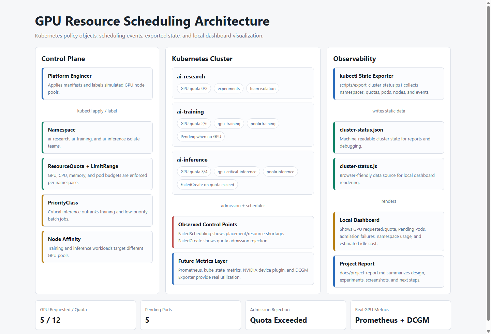
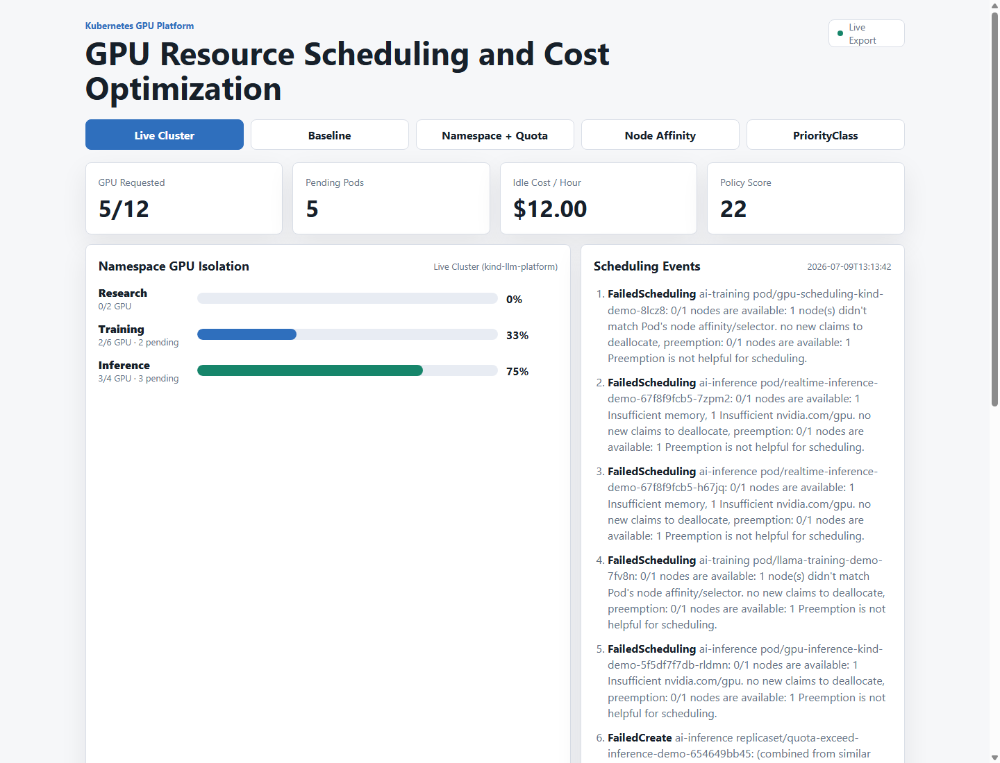
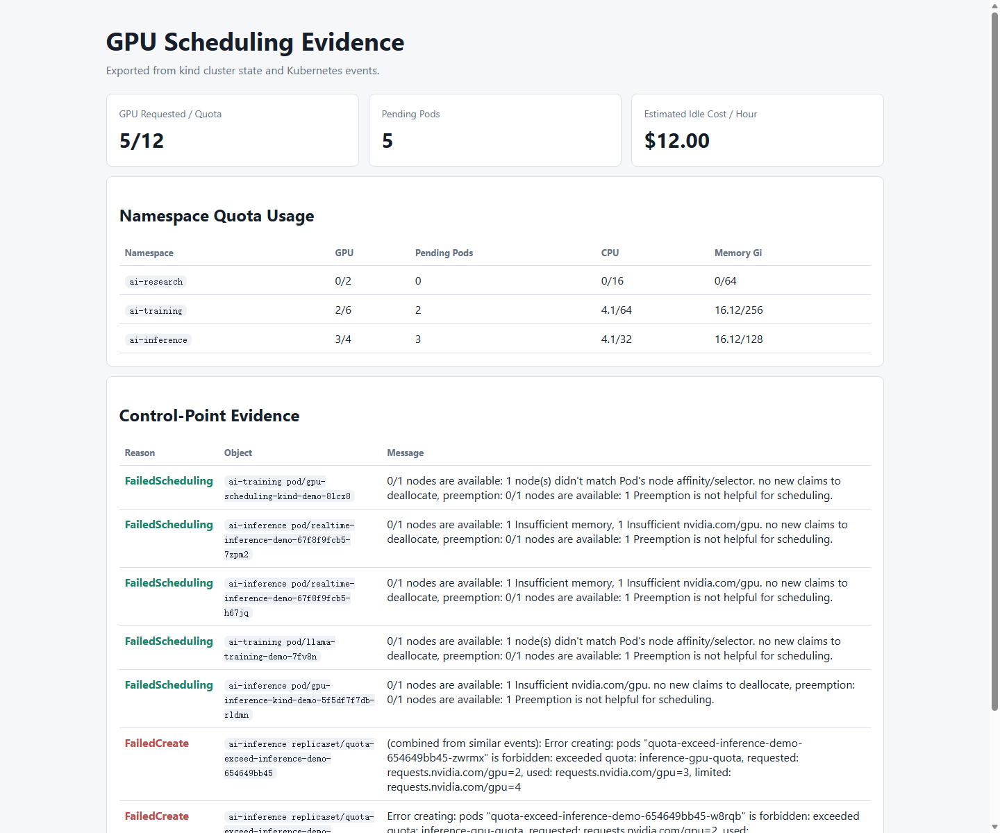

# GPU 资源调度与成本优化系统项目报告

## 1. 项目概述

本项目基于 Kubernetes 构建一个 GPU 资源调度与成本优化系统 MVP，用于展示多团队共享 GPU 集群时的资源隔离、配额控制、调度约束、优先级策略和成本可视化。

项目当前运行在本地 kind 集群 `kind-llm-platform` 上。由于本地 kind 节点没有真实 GPU，本项目通过 Kubernetes 原生调度事件展示 GPU 调度链路：Pod 通过 Namespace、Quota、PriorityClass 和 Node Affinity 检查后，最终因没有可分配的 `nvidia.com/gpu` 而进入 Pending；当请求超过 Namespace GPU 配额时，Pod 会在 admission 阶段被 ResourceQuota 拒绝创建。

## 2. 项目目标

- 展示不同团队的 GPU 资源隔离。
- 使用 ResourceQuota 限制各 Namespace 的 GPU、CPU、内存和 Pod 数量。
- 使用 Node Affinity 将训练和推理 workload 分配到不同 GPU 节点池。
- 使用 PriorityClass 表示生产推理、训练任务和低优先级 batch 任务的调度优先级。
- 导出真实 Kubernetes 状态，并在本地仪表盘中展示。
- 对比 Pending 调度失败和 Quota admission 拒绝两类不同控制点。

## 3. 技术栈

| 模块 | 技术 |
| --- | --- |
| 容器平台 | Kubernetes kind |
| 资源隔离 | Namespace, ResourceQuota, LimitRange |
| 调度策略 | Node Affinity, PriorityClass |
| 状态采集 | kubectl, PowerShell |
| 可视化 | HTML, CSS, JavaScript |
| 后续监控扩展 | Prometheus, kube-state-metrics, NVIDIA DCGM Exporter |

## 4. 项目结构

```text
gpu-scheduler-cost-optimizer/
  k8s/
    00-namespaces.yaml
    10-quotas-limits.yaml
    priorityclasses.yaml
    gpu-node-affinity-demo.yaml
    gpu-node-affinity-kind-demo.yaml
    gpu-inference-kind-demo.yaml
    quota-exceed-inference-demo.yaml
  scripts/
    status.ps1
    export-cluster-status.ps1
    cleanup.ps1
  web/
    index.html
    app.js
    styles.css
    data/cluster-status.json
    data/cluster-status.js
  docs/
    day1.md
    day2.md
    prometheus-queries.md
    project-report.md
    screenshots/
```

## System Architecture



The system has three layers:

- Control plane: Kubernetes manifests define Namespace, ResourceQuota, LimitRange, PriorityClass, and Node Affinity policies.
- Cluster execution: admission and scheduling produce observable `FailedCreate` and `FailedScheduling` events.
- Observability: `export-cluster-status.ps1` exports live `kubectl` state into the local dashboard.
## 5. 核心设计

### 5.1 Namespace 隔离

项目将 GPU 使用方拆分为三个 Namespace：

| Namespace | 团队/场景 |
| --- | --- |
| `ai-research` | 研究实验 |
| `ai-training` | 模型训练 |
| `ai-inference` | 在线推理 |

### 5.2 ResourceQuota 配额

各 Namespace 拥有独立 GPU 配额：

| Namespace | GPU 配额 |
| --- | ---: |
| `ai-research` | 2 |
| `ai-training` | 6 |
| `ai-inference` | 4 |

### 5.3 PriorityClass 优先级

| PriorityClass | Value | 用途 |
| --- | ---: | --- |
| `gpu-critical-inference` | 100000 | 生产推理 |
| `gpu-training` | 50000 | 训练任务 |
| `gpu-batch-low` | 10000 | 低优先级实验 |

### 5.4 Node Affinity 节点池

项目使用节点标签模拟 GPU 节点池：

```powershell
kubectl label node llm-platform-control-plane accelerator=nvidia-a100 --overwrite
kubectl label node llm-platform-control-plane gpu.platform/pool=inference --overwrite
kubectl label node llm-platform-control-plane topology.kubernetes.io/zone=local-a --overwrite
```

训练任务要求 `gpu.platform/pool=training`，推理任务要求 `gpu.platform/pool=inference`，从而展示不同类型 workload 的节点池隔离。

## 6. 实验结果

### 6.1 当前集群状态

当前导出的真实状态如下：

| 指标 | 数值 |
| --- | ---: |
| GPU Requested / Quota | 5 / 12 |
| Pending Pods | 5 |
| ai-training GPU 使用 | 2 / 6 |
| ai-inference GPU 使用 | 3 / 4 |
| ai-research GPU 使用 | 0 / 2 |

### 6.2 Node Affinity 与 GPU 不足

低资源训练样本 `gpu-scheduling-kind-demo` 的调度失败原因：

```text
0/1 nodes are available: 1 node(s) didn't match Pod's node affinity/selector.
```

当节点池标签匹配训练池后，失败原因推进为：

```text
0/1 nodes are available: 1 Insufficient nvidia.com/gpu.
```

这说明 Node Affinity 策略先决定 workload 能否进入候选节点集合；通过该门槛后，才会继续检查节点是否具备可分配 GPU。

### 6.3 推理节点池实验

推理低资源样本 `gpu-inference-kind-demo` 在节点池和 zone 标签匹配后，失败原因如下：

```text
0/1 nodes are available: 1 Insufficient nvidia.com/gpu.
```

这证明推理 workload 已通过 Node Affinity 约束，剩余问题是本地 kind 集群没有真实 GPU 资源。

### 6.4 Quota 超限实验

当 `ai-inference` 已使用 `3/4` GPU request 时，提交一个请求 2 张 GPU 的 workload：

```powershell
kubectl apply -f k8s/quota-exceed-inference-demo.yaml
```

ReplicaSet 创建 Pod 时被拒绝：

```text
exceeded quota: inference-gpu-quota,
requested: requests.nvidia.com/gpu=2,
used: requests.nvidia.com/gpu=3,
limited: requests.nvidia.com/gpu=4
```

该实验说明 ResourceQuota 是 admission 阶段的控制点。它和 Pending 的区别是：

| 现象 | 含义 |
| --- | --- |
| Pending | Pod 已创建，但调度器找不到可用节点 |
| FailedCreate | Pod 创建前被 ResourceQuota 拒绝 |

## 7. 仪表盘

项目提供本地 Web 仪表盘。先导出集群状态：

```powershell
.\scripts\export-cluster-status.ps1
```

然后打开：

```text
web/index.html
```

仪表盘读取 `web/data/cluster-status.js`，展示真实导出的 GPU request、Pending Pod、事件和 Namespace 配额使用情况。

截图：



实验结果截图：



## 8. 当前完成度

| 能力 | 状态 |
| --- | --- |
| Namespace 隔离 | 已完成 |
| ResourceQuota / LimitRange | 已完成 |
| PriorityClass | 已完成 |
| Node Affinity 训练池实验 | 已完成 |
| Node Affinity 推理池实验 | 已完成 |
| Quota 超限 admission 实验 | 已完成 |
| kubectl 状态导出 | 已完成 |
| Web 仪表盘读取真实导出数据 | 已完成 |
| Prometheus / DCGM 真实利用率 | 待扩展 |
| 真实 GPU 节点运行 | 待扩展 |

## 9. 后续扩展

- 在真实 GPU 节点上安装 NVIDIA device plugin。
- 部署 DCGM Exporter 和 kube-state-metrics。
- 用 Prometheus API 替换当前静态 JSON 导出。
- 按 GPU 型号配置不同小时成本。
- 增加利用率、显存使用率、空闲 GPU 成本和队列等待时间指标。

## 10. 结论

本项目已经完成一个可复现、可展示的 GPU 资源调度与成本优化 MVP。它通过 Kubernetes 原生对象证明了 GPU 资源隔离、调度约束、优先级策略和配额拒绝的核心机制，并提供了本地仪表盘用于展示真实导出的集群状态。后续接入真实 GPU 节点和 Prometheus/DCGM 后，可以进一步升级为完整的 GPU 利用率监控与成本优化系统。


